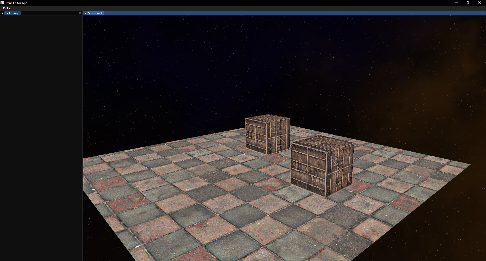

# Irene Engine
Irene Engine is a 3D rendering engine developed using C++ and OpenGL. 



### Controls
* Hold `Mouse button 5` or Hold `Left shift` and move mouse to orbit the camera.
* Hold `Mouse button 5` or Hold `Left shift` and
	* Hold `W` to move the camera forward.
	* Hold `A` to move the camera left.
	* Hold `S` to move the camera backward.
	* Hold `D` to move the camera right.
	* Hold `Q` to move the camera down.
	* Hold `E` to move the camera up.

## Get Started
### Prerequisites
* MS Visual studio

### Configure
* Run Win-GenerateProjects.bat file to generate VS project files.\
* Copy ```Irene\vendor\assimp\lib\assimp-vc142-mtd.dll``` to same folder as the executable.

### Build and Run
* Press F5 (in MS Visual Studio) to build and run the project.
